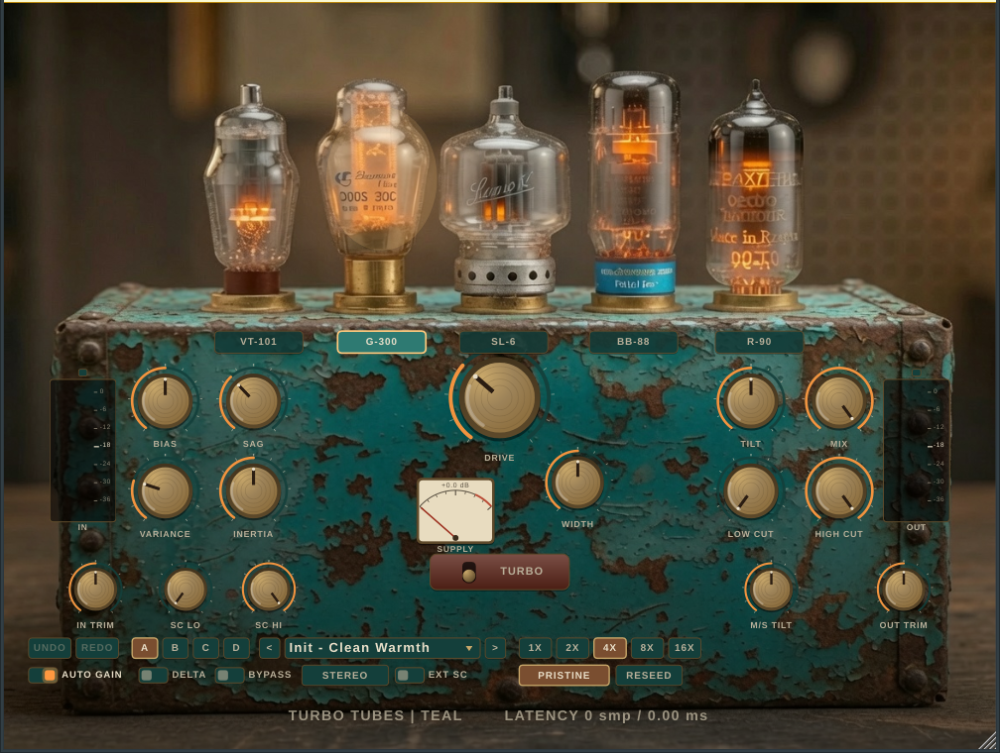

# TURBO TUBES

**Five bottles. One battered teal box.** A tube-saturation plugin that models how
tubes *behave*, not just how they curve — with measurement-grade engineering
underneath and a point of view on top.



*The faceplate is the actual photo of the unit: the five real bottles are the
model selectors (the selected tube glows with the signal), and every control —
all fifteen knobs, the meters, the SUPPLY gauge, the TURBO lever, and the
preset / snapshot / oversampling / sidechain controls — is mounted directly on
the box.*

## The point of view

Most saturators are a static waveshaper with a tone knob. Turbo Tubes is built
around three convictions:

1. **The dynamics ARE the sound.** Real tubes bloom, sag, and darken with the
   programme. The SAG knob is the master "how alive is this tube" control: it
   scales supply droop, bias creep (which grows the 2nd harmonic as you play
   harder), and the drive-dependent Miller rolloff. At SAG = 0 you get a
   perfectly static, measurement-clean saturator; at SAG = 10 the box breathes.
2. **Loudness is a lie.** Auto-gain is deterministic (a closed-form probe, not
   a follower), so A/B comparisons are honest and DRIVE becomes "how much
   tube", never "how much louder".
3. **You choose the CPU/quality trade.** Selectable 1x–16x oversampling with
   two filter tiers, exact latency reporting, and ADAA everywhere so even 1x is
   usable — zero-latency tracking is a preset, not a compromise.

## The five tubes

| Tube | Character | Signature |
|---|---|---|
| **VT-101 “Whisper”** | small-signal triode | gentle, 2nd-harmonic dominant, barely any sag — the always-safe vocal/bus tube |
| **G-300 “Globe”** | directly-heated big bottle | deep 2nd + 3rd, slow generous sag, bias bloom — romantic |
| **SL-6 “Silverbird”** | pentode | hard knee, odd-heavy (3rd/5th), quick sag — edge without fizz |
| **BB-88 “Blue Bottle”** | beam tetrode | punchy, fast sag that grabs transients, crossover grit as you push |
| **R-90 “Red Star”** | surplus military bottle | heavily asymmetric, strong bias drift, dark Miller rolloff — gnarly |

Every claim above is asserted by the test suite: the five harmonic signatures
are measured by FFT and must remain pairwise distinct for the build to pass.

**TURBO** cascades a second, hotter plate stage — from “warm glow” to
“driven stack” with one lever.

## Measured, not promised

`tests/dsp_tests.cpp` runs offline (no JUCE, no audio hardware) and gates every
technical claim. Current measurements (Release build, this repo):

| Spec | Measured |
|---|---|
| Oversampling filters (Pristine) | ±0.0001 dB passband ripple, −107 dB stopband |
| Oversampling filters (Punchy) | ±0.005 dB ripple, −65 dB stopband, ~¼ the latency |
| Latency accuracy | dry path aligns to the reported latency with **0.00e+00** error, every factor/quality |
| Delta mode | wet = dry + delta, sample-exact (max err 0.0) |
| Aliasing, hot drive (+14 dB overdriven 6 kHz sine, worst spur < 19 kHz) | 1x −32 dBFS · 4x **−71** · 8x **−94** |
| Aliasing, torture (+24 dB overdrive) | 4x −57 · 16x **−83** |
| Auto-gain accuracy | within ±1.5 dB across all 5 models × 0–36 dB drive |
| Programme dependence | burst test: gain recovers +0.3 dB after sag; identically static at SAG = 0 |
| Drift (VARIANCE = 10) | channels decorrelate, level match stays within 1.2 dB (mono-safe); VARIANCE = 0 is bit-identical |
| Block-size invariance | 512-sample blocks vs irregular 1–512 chop: **bit-identical** output |
| Stability fuzz | 60 randomized param/rate/block runs incl. mid-stream OS switches: no NaN/Inf ever |
| CPU | ~21× realtime for stereo 48 kHz at 4x Pristine + TURBO on one core of a small VM → dozens of instances |

Run them yourself: `cmake -B build && cmake --build build --target turbo_dsp_tests && ./build/turbo_dsp_tests`

## Engineering notes (the checklist, honestly)

- **Clean nonlinear processing** — every nonlinearity (grid knee, headroom
  clamp, both plate stages) is first-order ADAA with *exact closed-form
  antiderivatives* (algebraic sigmoid family + C³ Hermite knees, no
  transcendentals in the hot path), computed in double precision to kill the
  difference-quotient cancellation that silently costs ~50 dB in float.
  Oversampling stacks on top: polyphase Kaiser half-band FIR stages whose tap
  counts are constrained so total round-trip latency is an **integer at the
  base rate by construction** — which is what makes the sample-exact dry
  alignment, perfect delta null, and honest `setLatencySamples` possible.
- **Dynamic behavior, not a static curve** — per-model supply sag (headroom
  scales with a slow rectifier envelope), bias creep (operating point slides
  into the curve with level → programme-dependent even harmonics), and
  envelope-modulated Miller rolloff that opens up at low drive.
- **Trustworthy metering** — sample peak + AES-17 RMS (full-scale sine reads
  0 dBFS RMS), so a −18 dBFS sine reads −18 on both bars and the −18 tick on
  the meters means exactly that. Latching clip lamp, click to clear. The
  SUPPLY gauge shows real engine telemetry (supply squish), and the footer
  shows the actual reported latency.
- **Under the hood** — lock-free audio thread (no allocation, locks, or
  system calls in `process()`), all filter/oversampler configurations
  pre-designed in `prepare()` (runtime switching is routing only), denormal
  flushing plus `ScopedNoDenormals`, `std::atomic` telemetry to the UI,
  config changes (model/OS) go through short fades instead of clicking.
- **Sidechain** — internal (post-drive) or external detector with its own
  HP/LP filtering; the sidechain drives the tube *dynamics* (bias/sag), so a
  kick can make a pad bloom without any gain riding.
- **M/S** — process in stereo or mid/side, with an M/S drive tilt (push the
  sides into the tubes harder than the mid, or vice versa) and a width
  control that folds correctly to mono at 0.
- **A/B/C/D snapshots + undo** — four full-state slots (click to switch,
  right-click to copy the current sound in), persisted in the session, plus
  full undo/redo history of parameter moves.
- **Component variation** — VARIANCE adds seeded per-channel tolerances
  (bias, drive, Miller, trim) plus an ultra-slow bounded wander; RESEED rolls
  a new unit. The seed is saved with the session, so recall is exact.
- **Gain staging** — −18 dBFS is the engine's reference level: model
  parameters, detector normalisation, and the auto-gain probe all speak that
  language, so presets behave consistently at sane mix levels.

## Controls

| Control | What it does |
|---|---|
| DRIVE (0–10) | 0–36 dB into the stage. With AUTO GAIN on, loudness stays put. |
| BIAS | shifts the operating point (± even-harmonic balance, can flip asymmetry) |
| SAG | master dynamics depth: supply droop + bias bloom + Miller motion |
| INERTIA | time-constant scale for the dynamics (0.25×–4× the model's nature) |
| VARIANCE / RESEED | component-tolerance amount / roll a new unit |
| TILT / LOW CUT / HIGH CUT | post-tube tone: complementary shelves around 700 Hz + 12 dB/oct cuts (TPT, prewarped) |
| MIX | latency-compensated parallel blend (linear crossfade → true null at 50/50 delta tests) |
| DELTA | listen to exactly wet − dry — what the box is adding |
| WIDTH / M/S mode / M/S TILT | stereo image and mid-vs-side drive distribution |
| OS 1X–16X + PUNCHY/PRISTINE | quality vs CPU vs latency, switchable while playing |
| SC EXT + SC LO/HI | external sidechain with detector filtering |

## Installing on Windows

A Windows installer is built automatically by GitHub Actions
(`.github/workflows/windows-installer.yml`):

- **Any commit** — grab `TurboTubes-Windows-<version>` from the run's
  **Artifacts** (the `.exe` installer + a portable `.zip`).
- **Tagged release** (`v1.0.0`, …) — the installer is attached to the
  GitHub Release.

The installer (Inno Setup) places the VST3 in the shared
`C:\Program Files\Common Files\VST3` folder and the Standalone app in
Program Files; both components are individually selectable. To build it
locally on Windows: `cmake -B build -G "Visual Studio 17 2022" -A x64 && cmake
--build build --config Release`, then run
`ISCC packaging\windows\TurboTubes.iss`.

## Building

Requires CMake ≥ 3.22 and a C++20 compiler. JUCE 8.0.8 is fetched
automatically (or point `FETCHCONTENT_SOURCE_DIR_JUCE` at a local copy).

```bash
cmake -B build -DCMAKE_BUILD_TYPE=Release
cmake --build build -j                       # VST3 + AU (macOS) + Standalone + tests
ctest --test-dir build                       # run the DSP verification suite
```

- **Formats**: VST3 (Windows/macOS/Linux), AU (macOS), Standalone.
  AAX builds when you point at the SDK: `-DTT_AAX_SDK_PATH=/path/to/AAX_SDK`.
- **Apple Silicon**: universal binaries (`arm64 + x86_64`) by default.
- **Linux deps**: `libasound2-dev libx11-dev libxext-dev libxinerama-dev
  libxrandr-dev libxcursor-dev libfreetype-dev libfontconfig1-dev
  mesa-common-dev libgl1-mesa-dev`.
- **Licensing**: GPLv3. No dongle, no activation, no phone-home
  (`JUCE_WEB_BROWSER=0`, `JUCE_USE_CURL=0`, splash disabled under GPL).

## Repository layout

```
dsp/      JUCE-free DSP core (header-only, std C++20) — usable outside the plugin
plugin/   JUCE processor, parameters, presets, editor, vector UI
tests/    offline verification suite (FFT analyzer, null tests, fuzz, bench)
docs/     screenshots
```

## Presets

Fifteen factory presets, each teaching a workflow: vocal silk/attitude, mix-bus
glue, 16x master sheen, drum-bus punch, parallel crush, bass thickening,
kick-triggered bloom (external SC), side shimmer & mid focus (M/S), tape-ish
motion (high VARIANCE), edge & air, fuzz box, and zero-latency tracking.
